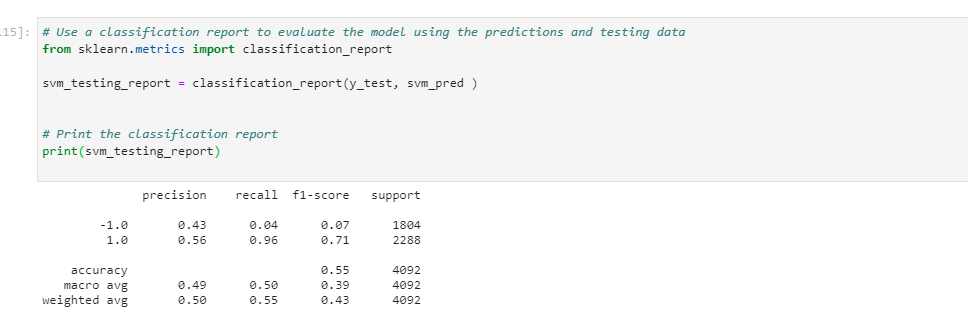
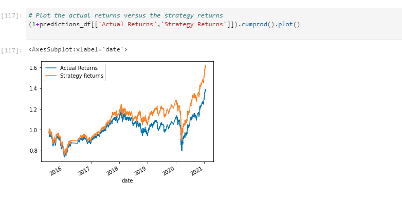
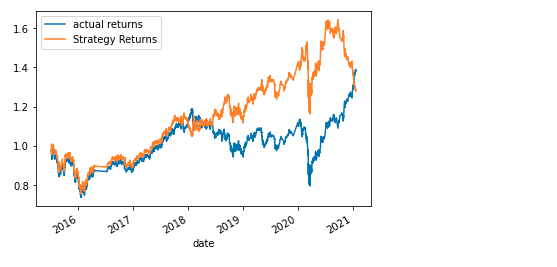
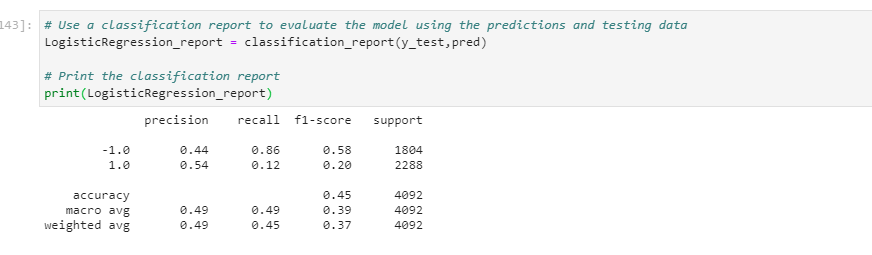
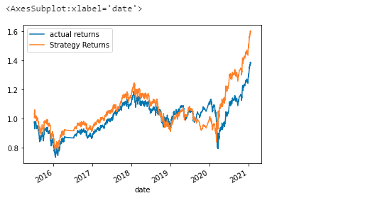
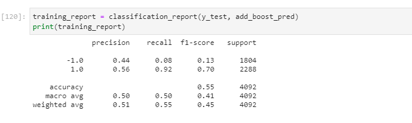
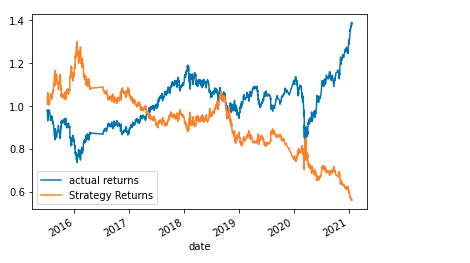
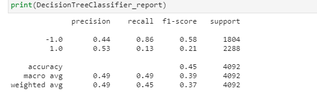

# Machine_Learning_Trading_Bot-
One of the top five financial advisory firms constantly competes with the other major firms to manage and automatically trade assets in a highly dynamic environment. In recent years, firm has heavily profited by using computer algorithms that can buy and sell faster than human traders. The speed of these transactions gave firm a competitive advantage early on. But, people still need to specifically program these systems, which limits their ability to adapt to new data. 

On this project, we are planning to improve the existing algorithmic trading systems and maintain the firm’s competitive advantage in the market. To do so, we enhance the existing trading signals with machine learning algorithms that can adapt to new data.


## Technologies

This project leverages python 3.7 with the following packages:

* [Pandas](https://pandas.pydata.org/) - For data cleaning, preparation and manipulation

* [Jupyter Notebook](https://jupyter.org/) - An open-source web application that allows you to create and share documents that contain live code, equations, visualizations and narrative text.

* [Visual Studio Code](https://code.visualstudio.com/) - A code editor redefined and optimized for building and debugging modern web and cloud applications

## Installation Guide

Before running the application first install the following dependencies.

```python
import pandas as pd
import numpy as np
from pathlib import Path
import hvplot.pandas
import matplotlib.pyplot as plt
from sklearn import svm
from sklearn.preprocessing import StandardScaler
from pandas.tseries.offsets import DateOffset
from sklearn.metrics import classification_report
from sklearn.ensemble import AdaBoostClassifier
from sklearn.tree import DecisionTreeClassifier
from sklearn.linear_model import LogisticRegression
```

To install PyViz and its dependencies in your Conda dev environment, complete the following steps:

1. From your terminal, log in to your Conda dev environment.

2. Install the PyViz packages by using the conda install command as follows:
    conda install -c plotly plotly=4.13.
    conda install -c pyviz hvplot
    
    
   ## Usage
   
   
   
   What percent of your predictions were correct? 
   
   What percent of the positive cases did you catch?

---------------------------------------------------------------------------------------------------------------------------------------------------------------------------
    
  
    
    ---------------------------------------------------------------------------------------------------------------------------------------------------------------------------

   
   
   
   ---------------------------------------------------------------------------------------------------------------------------------------------------------------------------
     
   
   


---------------------------------------------------------------------------------------------------------------------------------------------------------------------------
   
   
   
---------------------------------------------------------------------------------------------------------------------------------------------------------------------------
   
     
   
   
   ---------------------------------------------------------------------------------------------------------------------------------------------------------------------------
 
   
   
   
   ---------------------------------------------------------------------------------------------------------------------------------------------------------------------------
  
   
   
   ---------------------------------------------------------------------------------------------------------------------------------------------------------------------------
 
  
