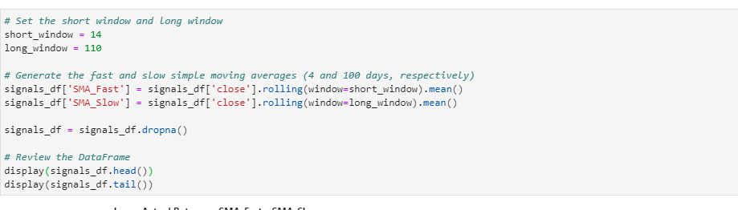
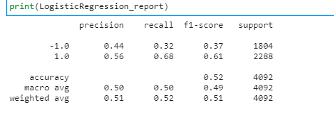
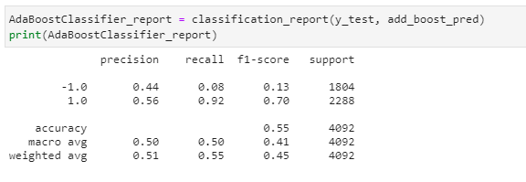

# Machine_Learning_Trading_Bot-
One of the top five financial advisory firms constantly competes with the other major firms to manage and automatically trade assets in a highly dynamic environment. In recent years, firm has heavily profited by using computer algorithms that can buy and sell faster than human traders. The speed of these transactions gave firm a competitive advantage early on. But, people still need to specifically program these systems, which limits their ability to adapt to new data. 

On this project, we are planning to improve the existing algorithmic trading systems and maintain the firm’s competitive advantage in the market. To do so, we enhance the existing trading signals with machine learning algorithms that can adapt to new data.


## Technologies

This project leverages python 3.7 with the following packages:

* [Pandas](https://pandas.pydata.org/) - For data cleaning, preparation and manipulation

* [Jupyter Notebook](https://jupyter.org/) - An open-source web application that allows you to create and share documents that contain live code, equations, visualizations and narrative text.

* [Visual Studio Code](https://code.visualstudio.com/) - A code editor redefined and optimized for building and debugging modern web and cloud applications

## Installation Guide

Before running the application first install the following dependencies.

```python
import pandas as pd
import numpy as np
from pathlib import Path
import hvplot.pandas
import matplotlib.pyplot as plt
from sklearn import svm
from sklearn.preprocessing import StandardScaler
from pandas.tseries.offsets import DateOffset
from sklearn.metrics import classification_report
from sklearn.ensemble import AdaBoostClassifier
from sklearn.tree import DecisionTreeClassifier
from sklearn.linear_model import LogisticRegression
```

To install PyViz and its dependencies in your Conda dev environment, complete the following steps:

1. From your terminal, log in to your Conda dev environment.

2. Install the PyViz packages by using the conda install command as follows:
    conda install -c plotly plotly=4.13.
    conda install -c pyviz hvplot
    
    
   ## Usage
   Results of SVM classification metrics - 
   
   What percent of your predictions were correct for 'sell'? - 43%
   What percent of your predictions were correct for 'buy'? - 56%
   
   What percent of the positive cases did you catch for 'sell'? - 4%
   What percent of the positive cases did you catch for 'buy'? - 96%
   
   
   
   ---------------------------------------------------------------------------------------------------------------------------------------------------------------------------
    
   Results of using SVM model, 'strategy predicted returns' are higher then 'actual returns'
   
  
    
  
    
    
   -----------------------------------------------------------------------------------------------------------------------------------------------------------------------------
    
   Results of using 2nd SVM model by changing the parameters like short window and long window, 'strategy predicted returns' are higher then 'actual returns'
   
   What impact resulted from changing Train and Test dataset? - the predicted strategy returns same as  actual returns .
   
   What impact resulted from increasing or decreasing either or both of the SMA windows? - the predicted strategy returns are coming same as actual returns as seen from the cummulative graph plot.
    
  
  
  
  
    ---------------------------------------------------------------------------------------------------------------------------------------------------------------------------

   Results of logistics regression model, 'strategy predicted returns' are higher then 'actual returns' in starting and then goes down towards the end.
    
   
   
   ---------------------------------------------------------------------------------------------------------------------------------------------------------------------------
     
   Results of Logistics Regression classification metrics - 
   
   What percent of your predictions were correct for 'sell'? - 44%
   What percent of your predictions were correct for 'buy'? - 54%
   
   What percent of the positive cases did you catch for 'sell'? - 86%
   What percent of the positive cases did you catch for 'buy'? - 12%
   
   


---------------------------------------------------------------------------------------------------------------------------------------------------------------------------
   
    Results of AdBoost model, 'strategy predicted returns' are higher then 'actual returns' in starting and then goes down towards the end.
      
   
   
---------------------------------------------------------------------------------------------------------------------------------------------------------------------------
   
   Results of AddBoost classification metrics - 
   
   What percent of your predictions were correct for 'sell'? - 44%
   What percent of your predictions were correct for 'buy'? - 54%
   
   What percent of the positive cases did you catch for 'sell'? - 86%
   What percent of the positive cases did you catch for 'buy'? - 12%
   
     
   
   
   ---------------------------------------------------------------------------------------------------------------------------------------------------------------------------
 
   Results of DecisionTree model, 'strategy predicted returns' are higher then 'actual returns' in starting and then goes down towards the end.
       
   
   
   ---------------------------------------------------------------------------------------------------------------------------------------------------------------------------
  
   Results of DecisionTree classification metrics - 
   
   What percent of your predictions were correct for 'sell'? - 44%
   What percent of your predictions were correct for 'buy'? - 54%
   
   What percent of the positive cases did you catch for 'sell'? - 86%
   What percent of the positive cases did you catch for 'buy'? - 12%
  
   
   
   ---------------------------------------------------------------------------------------------------------------------------------------------------------------------------
 
  Evalutaion report - 
  
Conclusion is that the SVM model has significantly good results because the strategically predicted returns are coming higher then actual returns. And, when we used different models like   AdBoost, the strategic returns were high all throughout the time, except during the time June 2019-June 2010 where it's lower than the actual returns as seen from the       cumulative graph.

Similarly, with the Logistic regression model, strategic returns were higher than actual returns throughout the time and more during the time June 2019 to until 2021.
However, with the Decision model, Strategic returns were high until June 2018 but then lower than actual returns.
  
Looks like out all these models, 'adaboost' and 'SVM' model is performing better because 'strategic' return is significantly higher then 'actual returns'
